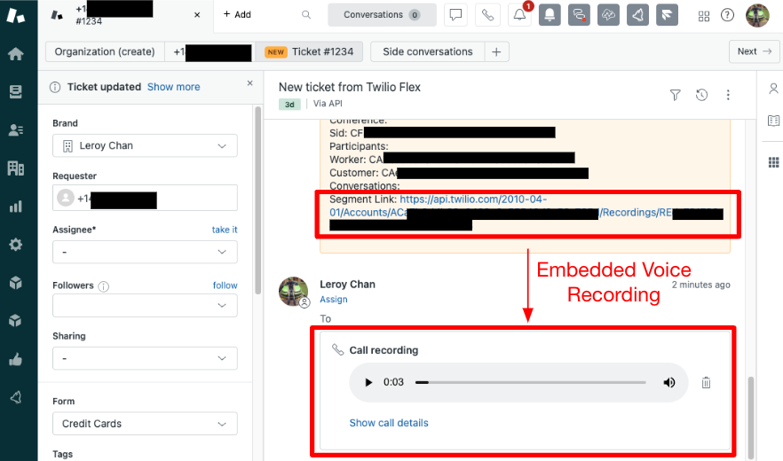
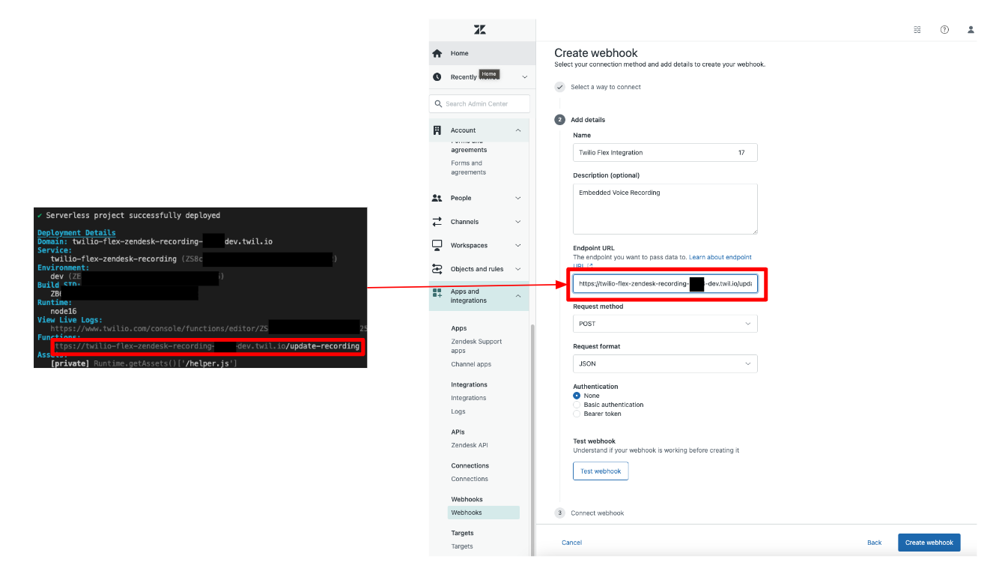
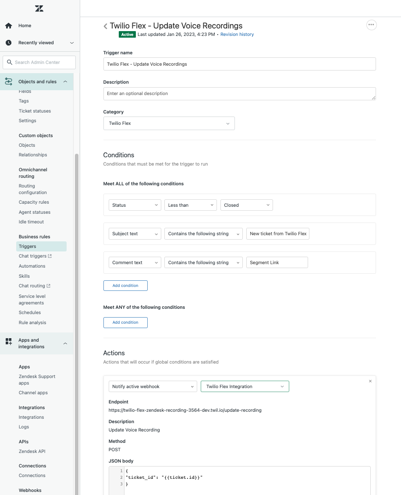

# Twilio Flex + Zendesk - Embedded Voice Recording

_Twilio Flex + Zendesk - Embedded Voice Recording_ is an extension to the native [Flex integration into Zendesk](https://www.twilio.com/docs/flex/admin-guide/integrations/zendesk) that automatically embeds Twilio Flex's Voice Recording as a Voice Comment in Zendesk. It leverages Twilio Functions as a RESTful API middleware between Twilio Flex and Zendesk.

_Note: This extension is to be used concurrently with the native [Flex integration into Zendesk](https://www.twilio.com/docs/flex/admin-guide/integrations/zendesk)_



---

## Pre-requisites

1. Twilio Flex Account ([Guide](https://support.twilio.com/hc/en-us/articles/360020442333-Setup-a-Twilio-Flex-Account))
2. Twilio Voice Recording - Enabled ([Guide](https://support.twilio.com/hc/en-us/articles/360010785673-Call-Recording-with-Twilio-Flex))
3. Node.js v16.x.x only ([Guide](https://docs.npmjs.com/downloading-and-installing-node-js-and-npm))
4. Twilio CLI v5.3.3 or above ([Guide](https://www.twilio.com/docs/twilio-cli/quickstart))
5. Twilio CLI Serverless Plugin v3.1.3 or above ([Guide](https://www.twilio.com/docs/labs/serverless-toolkit/getting-started))
6. Zendesk Instance with Twilio Flex Integrated ([Guide](https://www.twilio.com/docs/flex/admin-guide/integrations/zendesk))

---

## Getting Started

### Step 1: Obtain Zendesk Instance Credentials

Login to your Zendesk instance and navigate to `Admin Center`. Under `Apps and Integration > APIs > Zendesk API`, create a new API token.

You will need the following before proceeding:

1. Zendesk Subdomain
2. Zendesk Username
3. Zendesk API Token

### Step 2: Deploy Embedded Voice Recording Middleware

On your terminal, perform the following:

```
// Clone Project
git clone https://github.com/leroychan/twilio-flex-zendesk-recording.git

// Change to working directory
cd twilio-flex-zendesk-recording

// Install NPM Packages
npm install

// Copy sample enviroment file
cp .env.example .env
```

Configure the `.env` file using your preferred code editor with all the required values obtained from Step 1. You can leave `ACCOUNT_SID=xxx` and `AUTH_TOKEN=xxx` empty as it will be populated by default during run time.

Before you deploy, ensure that `twilio profiles:list` has an active account set.

Once configured and you are ready to deploy it, go back to your terminal and issue the following command:

```
twilio serverless:deploy
```

### Step 3: Create Webhook on Zendesk's Admin Center

After you have successfully deployed the Twilio Function, copy the the entire API path of `/update-recording` and head to `Zendesk's Admin Center`. Under `Apps and Integration > Webhooks > Webhooks`, create a new webhook

1. Select a way to connect: `Trigger or Automation`
2. Name: `Twilio Flex Integration`
3. Description: `Embedded Voice Recording`
4. Endpoint URL: `YOUR-TWILIO-FUNCTION-URL`
5. Request method: `POST`
6. Request format: `JSON`
7. Authentication: `None`



### Step 4: Create Trigger on Zendesk's Admin center

Head to `Zendesk's Admin Center`. Under `Object and rules > Business Rules > Triggers`, create a new trigger

1. Trigger name: `Twilio Flex - Update Voice Recordings`
2. Description: `Embedded Voice Recording`
3. Conditions - Meet ALL of the following conditions
   - `Status Less than Closed`
   - `Subject Text contains the following string: "New Ticket from Twilio Flex"`
   - `Comment Text contains the following string: "Segment Link"`
4. Action: `Notify active webhook` - Select your webhook created in Step 3
   - JSON Body:
   ```
   {
       "ticket_id": "{{ticket.id}}"
   }
   ```

_Note: Modify the Trigger's Subject Text depending on your `New ticket description` configuration of Twilio Flex + Zendesk integration_



### Step 5: Done !

Congratulations! You are now ready to start testing the Embedded Voice Recording on Zendesk!

Start by calling your associated Twilio Flex's phone number and accept the call on the Zendesk's Agent interface. Once you complete the task, you should see a new Voice Comment automatically appended onto the ticket.

---

## License

MIT
